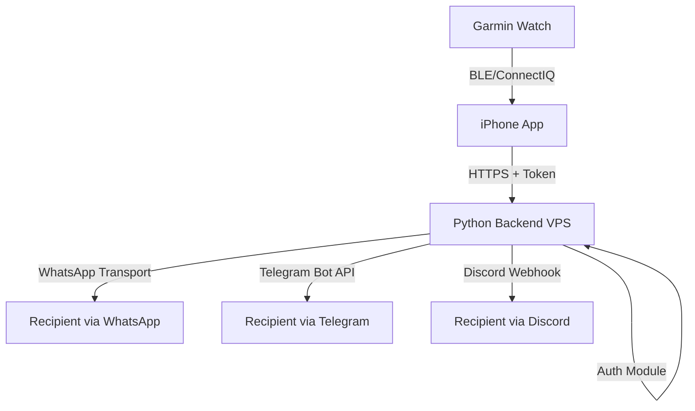

# Wrist2Whats - Architecture Design

## Overview
The architecture consists of three layers:
1. **Garmin Watch App** (ConnectIQ)
2. **iPhone Companion App**
3. **Cloud Backend (Python on VPS)**

### Communication Flow
Garmin App → iPhone App → Cloud Server → Messaging Interface → Recipient

### Technologies
- Garmin ConnectIQ SDK (Monkey C)
- Swift (iPhone companion app)
- Python (Flask/FastAPI backend)
- Telegram Bot API integration
- Discord Webhook integration
- WhatsApp transport (to be finalized: Business Platform API, approved gateway, or iOS relay)
- Docker container on VPS (Ubuntu)

### Authentication Design
- **Token Authority (Backend)**: Dedicated auth service/module issues short-lived access tokens to the iPhone companion app after it authenticates using the user’s Garmin account + device-bound secret. Tokens are stored only on the phone’s secure enclave/keychain.
- **Request Signing**: Every HTTPS request from the iPhone to the backend includes the bearer token plus an HMAC signature over the payload using a per-device key. Backend validates token and signature before processing `/send`.
- **Garmin ↔ iPhone pairing**: During initial pairing, the phone provisions a device-specific secret onto the watch (encrypted via ConnectIQ storage). Watch triggers always include a nonce so the phone can reject replays before forwarding to the backend.
- **Key Rotation / Revocation**: Backend tracks active device keys; compromised devices can be revoked by deleting their key records, forcing re-enrollment.
- **Transport Security**: All outbound links (Garmin BLE channel, HTTPS between phone and backend, backend → messaging APIs) must use TLS or platform-encrypted channels. Certificates on the VPS are managed with automated renewal (e.g., Let’s Encrypt).

## Deployment Diagram

