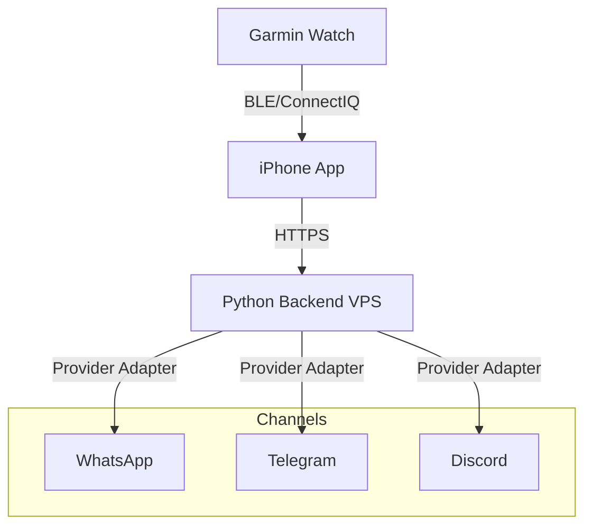

# Wrist2Whats - Architecture Design

## Overview
The architecture consists of three layers:
1. **Garmin Watch App** (ConnectIQ)
2. **iPhone Companion App**
3. **Cloud Backend (Python on VPS)**

### Communication Flow
Garmin App → iPhone App → Cloud Server → Channel Provider (WhatsApp/Telegram/Discord) → Recipient

### Technologies
- Garmin ConnectIQ SDK (Monkey C)
- Swift (iPhone companion app)
- Python (Flask/FastAPI backend)
- Docker container on VPS (Ubuntu)
- Messaging providers: WhatsApp API/automation, Telegram Bot API, Discord Bot API/Webhooks

## Deployment Diagram

## Channel Abstraction
The backend exposes a single message API and delegates delivery to a provider adapter
based on a `platform` parameter. Supported values: `whatsapp`, `telegram`, `discord`.
This design enables adding future channels with minimal changes.
