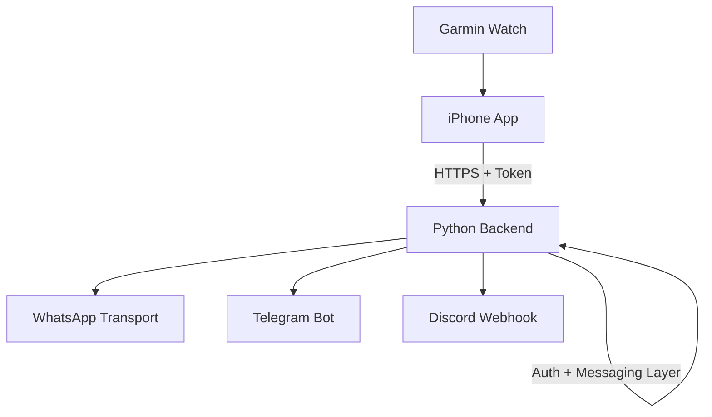

# Wrist2Whats - Architecture Design

## Components
- **Watch app** collects the user’s contact/template choice and sends a trigger over BLE.
- **iPhone app** receives the trigger, fills in the message, and calls the backend.
- **Python backend** validates the request, picks the right transport, and talks to external services.

## Message Path
1. Watch → iPhone (BLE / ConnectIQ).
2. iPhone → Backend (`/send` over HTTPS with auth).
3. Backend → WhatsApp / Telegram / Discord.
4. Backend returns status to the iPhone so the watch can show success/failure.

## Authentication (Design Only)
- Phone authenticates once and stores a device token from the backend; the token sits in the iOS keychain.
- Every `/send` call includes the bearer token plus an HMAC signed with the device secret.
- Backend keeps a table of device keys so tokens can be rotated or revoked.
- All hops (BLE + HTTPS) stay encrypted; VPS certificates are managed automatically.

## Messaging Integrations
- **WhatsApp**: choose one path (Meta Business API, an approved relay, or an iOS automation relay) and plug it into the backend’s messaging layer.
- **Telegram**: Bot API sendMessage.
- **Discord**: Webhooks.

## Deployment Diagram

