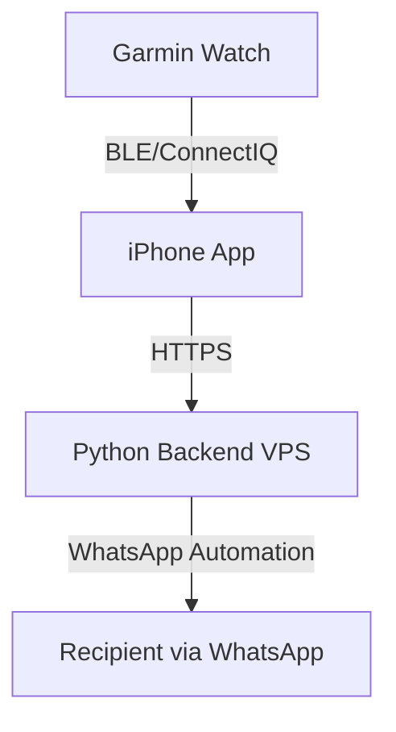

# Wrist2Whats - Architecture Design

## Overview
The architecture consists of three layers:
1. **Garmin Watch App** (ConnectIQ)
2. **iPhone Companion App**
3. **Cloud Backend (Python on VPS)**

### Communication Flow
Garmin App → iPhone App → Cloud Server → WhatsApp Web API → Recipient

### Technologies
- Garmin ConnectIQ SDK (Monkey C)
- Swift (iPhone companion app)
- Python (Flask/FastAPI backend)
- Docker container on VPS (Ubuntu)

## Deployment Diagram

