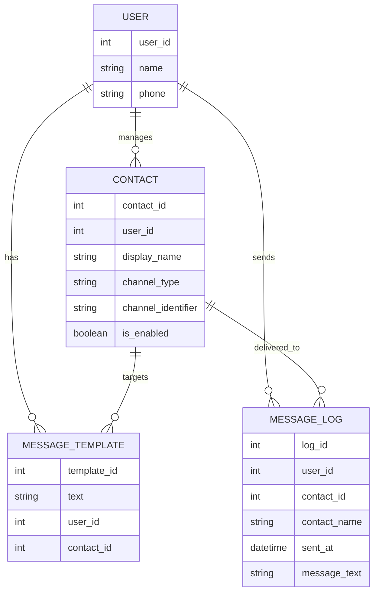

# Wrist2Whats - Entity Relationship Diagram (ERD)

```mermaid
erDiagram
    USER {
        int user_id
        string name
        string phone
    }
    CONTACT {
        int contact_id
        int user_id
        string display_name
        string channel_type
        string channel_identifier
        boolean is_enabled
    }
    MESSAGE_TEMPLATE {
        int template_id
        string text
        int user_id
        int contact_id
    }
    MESSAGE_LOG {
        int log_id
        int user_id
        int contact_id
        string contact_name
        datetime sent_at
        string message_text
    }

    USER ||--o{ MESSAGE_TEMPLATE : has
    USER ||--o{ MESSAGE_LOG : sends
    USER ||--o{ CONTACT : manages
    CONTACT ||--o{ MESSAGE_TEMPLATE : targets
    CONTACT ||--o{ MESSAGE_LOG : delivered_to
```
