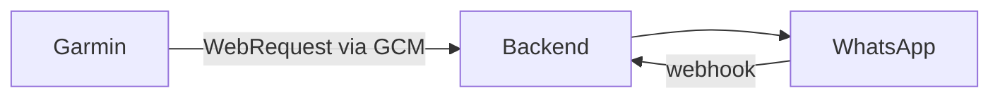

# Wrist2Whats - Low Level Design

## Garmin App (Monkey C)
- `MainView.mc` → Displays dropdown for contacts/messages.
- `WebRequestClient.mc` → Uses `Toybox.Communications.makeWebRequest` via Garmin Connect Mobile to call backend.
- `AuthManager.mc` → Attaches short-lived token to requests.

## Configuration UI
- Web dashboard for managing contacts and message templates (mobile-friendly). Synchronizes with backend.

## Python Backend
- `app.py` → FastAPI application exposing REST endpoints.
- `whatsapp_service.py` → Sends messages via WhatsApp Business Cloud API.
- `webhooks.py` → Handles WhatsApp webhook callbacks for delivery status.
- `queue_worker.py` → Async job processor (Celery/RQ) for non-blocking dispatch.
- `db_manager.py` → Manages message logs, contacts, and templates.

## Data Flow

