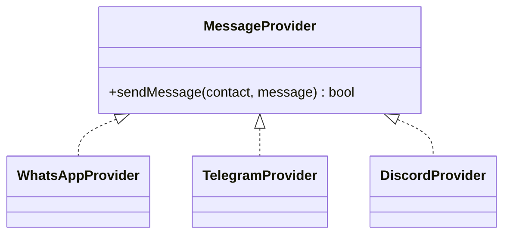

# Wrist2Whats - Low Level Design

## Garmin App (Monkey C)
- `MainView.mc` → Displays dropdown for contacts/messages.
- `CommHandler.mc` → Handles BLE connection to iPhone app.

## iPhone App (Swift)
- `BLEManager.swift` → Listens to Garmin data packets.
- `NetworkManager.swift` → Sends HTTPS POST to backend.
- `ConfigManager.swift` → Loads templates and contact lists.

## Python Backend
- `backend_app.py` → REST API to receive message requests.
- `providers/base.py` → Defines `MessageProvider` interface.
- `providers/whatsapp_provider.py` → WhatsApp implementation.
- `providers/telegram_provider.py` → Telegram Bot API implementation.
- `providers/discord_provider.py` → Discord Webhook/Bot implementation.
- `db_manager.py` → Manages message logs and configurations.

## Provider Interface


## Data Flow
```mermaid
flowchart LR
    Garmin --> iPhone --> Backend --> ProviderAdapter --> (WhatsApp | Telegram | Discord)
```
