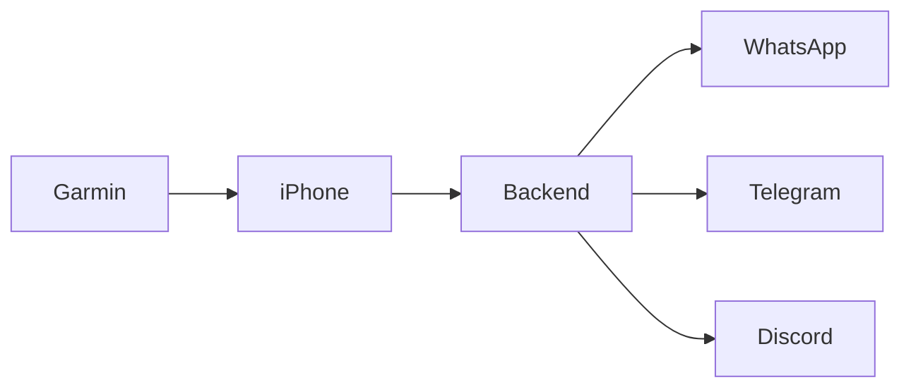

# Wrist2Whats - Low Level Design

## Garmin App (Monkey C)
- `MainView.mc` → Displays dropdown for contacts/messages.
- `CommHandler.mc` → Handles BLE connection to iPhone app.

## iPhone App (Swift)
- `BLEManager.swift` → Listens to Garmin data packets.
- `NetworkManager.swift` → Sends HTTPS POST to backend.
- `ConfigManager.swift` → Loads templates and contact lists.

## Python Backend
- `backend_app.py` → REST API to receive message requests and dispatches to messaging interfaces.
- `WhatsappInterface` → Adapter for WhatsApp integration (automation or API gateway).
- `TelegramInterface` → Adapter for Telegram Bot API.
- `DiscordInterface` → Adapter for Discord Webhooks.

## Data Flow

